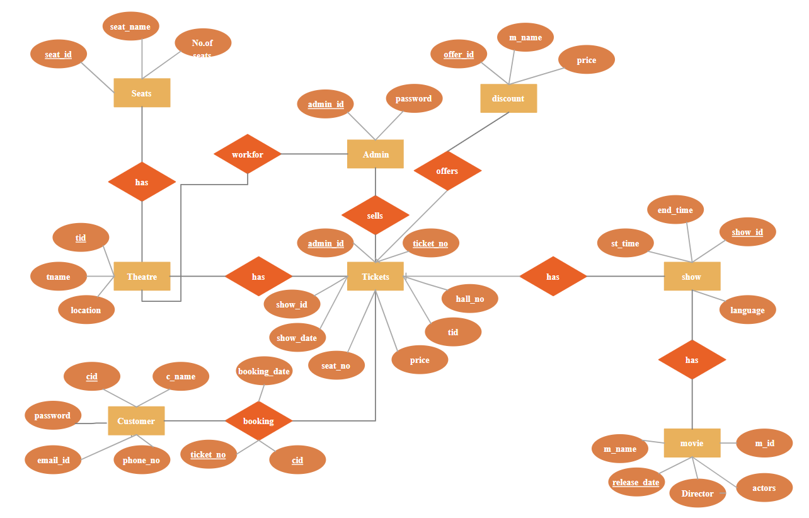

# `Movie Management System` 

By Habiba Rajab

**[Video Overview](<https://youtu.be/iXDLTEDoMIw>)**

## Project Overview:

This document provides a comprehensive overview of the database schema, including the structure of each table,
their relationships, and the purpose they serve within the system.

## Purpose
The Movie Ticket Booking System database schema is designed to handle the essential functionalities
required for managing movie bookings. It provides a structured approach to storing user information,
movie details, show times, seat availability, bookings, and payment records. This schema can be extended
or modified as needed to accommodate additional features or requirements in the future.

## Scope:

The database consists of the following tables:

Users: Stores user information.
Movies: Holds details about movies available for booking.
Seats: Contains information about the seating arrangement.
Show Time: Represents the schedule for movie screenings.
Booking: Records individual bookings made by users.
Payment: Tracks payment information related to bookings.

## Entity and Relationship

Entity:

1. Users Table
user_id: Unique identifier for each user (Primary Key).
user_name: Name of the user.
user_email: Email address of the user.
user_phone: Phone number of the user.
user_password: Hashed password for user authentication.

2. Movies Table
movie_id: Unique identifier for each movie (Primary Key).
movie_name: Name of the movie.
movie_language: Language in which the movie is available.
movie_genre: Genre of the movie (e.g., Action, Drama).
movie_rating: Rating of the movie (e.g., PG-13, R).

3. Seats Table
seat_id: Unique identifier for each seat (Primary Key).
row_num: Row number where the seat is located.
seat_num: Seat number within the row.
available: Indicates whether the seat is available (1 for available, 0 for booked).

4. Show Time Table
show_id: Unique identifier for each show time (Primary Key).
movie_id: Foreign key referencing the movies table.
show_time: The scheduled time for the show.
start_time: Actual start time of the movie.
end_time: Actual end time of the movie.
amount: Ticket price for the show.

5. Booking Table
booking_id: Unique identifier for each booking (Primary Key).
showtime_id: Foreign key referencing the show_time table.
seat_id: Foreign key referencing the seats table.
userr_name: Name of the user making the booking.
user_email: Email of the user making the booking.
user_phone: Phone number of the user making the booking.
booking_date: Date and time when the booking was made.
booking_status: Status of the booking (e.g., Confirmed, Canceled).

6. Payment Table
payment_id: Unique identifier for each payment (Primary Key).
booking_id: Foreign key referencing the booking table.
total_amount: Total payment amount for the booking.
payment_method: Method used for payment (e.g., Credit Card, PayPal).
date: Date and time when the payment was made.

Relationship:

users (1) --- (N) booking

booking (1) --- (1) payment

show_time (1) --- (N) booking

movies (1) --- (N) show_time

seats (1) --- (N) booking

## Entity Relationship Diagram
  

## Optimizations

Normalization: The schema is well-normalized, which reduces data redundancy. Each table serves a specific purpose (e.g., booking, movies, payment, etc.), making the data structure clear and organized.

Primary Keys and Auto-Increment: Each table has a primary key with an auto-increment feature, ensuring unique identifiers for records. This is efficient for indexing and retrieval operations.

Data Types: The choice of data types (e.g., varchar, int, decimal) is appropriate for the data being stored, optimizing storage space and enhancing performance.

Use of InnoDB: The use of the InnoDB storage engine supports transactions, foreign keys, and row-level locking, which improves data integrity and concurrency in a multi-user environment.

Indexes: Primary keys are indexed by default, which enhances the speed of queries that involve these keys.

## Limitations

Lack of Foreign Keys: The schema lacks foreign key constraints, which would ensure referential integrity between related tables (e.g., booking.showtime_id should reference show_time.show_id, etc.). This can lead to orphaned records and data inconsistencies.

Redundant User Information: User information may be repeated across the booking table, which can lead to data redundancy and difficulties in updating user details. A better approach might involve linking bookings directly to a user ID from the users table.

Limited Scalability: The current design may face scalability issues as the number of bookings, users, and shows grows. Consideration for partitioning or sharding strategies may be necessary for high-traffic applications.

Inflexible Payment Handling: The payment table only allows for a single payment method. Future needs might require support for multiple payment methods or a more complex payment process, which this schema does not accommodate.

No Audit Trail or History: There is no mechanism for tracking changes or maintaining a history of bookings, payments, or user details. This could be important for reporting and auditing purposes.

Potential Performance Issues: Depending on how the application is designed, frequent joins across multiple tables (such as booking, users, payment, etc.) could lead to performance bottlenecks if not properly indexed and optimized
